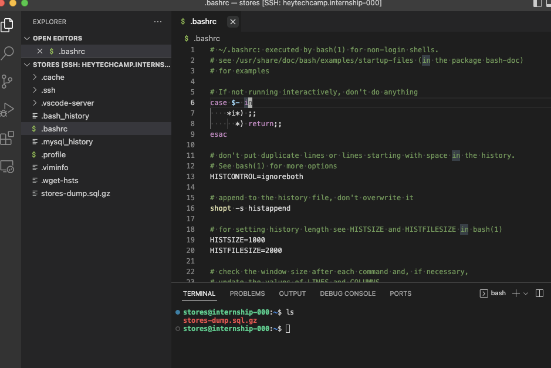

# Tips
ここでは heytechcamp サーバや stores データベースを扱うのに便利な Tips を説明します。

## Visual Studio Code Remote - SSH を用いた開発
SSH でアクセスしたサーバ上で開発するには Visual Studio Code の Remote - SSH 拡張機能 <https://marketplace.visualstudio.com/items?itemName=ms-vscode-remote.remote-ssh> の利用がオススメです。

SSH アクセス先のファイルをローカルのファイルと同様に編集することができます。

また Remote - SSH で接続した状態の Visual Studio Code 上で Terminal を開くことも可能なため、ほとんどの操作を Visual Studio Code で完結させることができます。

